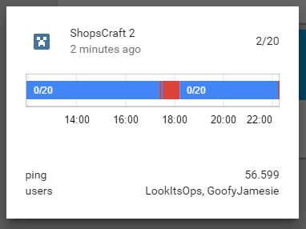

# Minecraft Server Home Assistant Sensor
"Now you too can flash your living room lights when someone joins your Minecraft server!"



Add `minecraft.py` to your `custom_components/sensor` folder and use this in your config:
```
sensor:
  platform: minecraft
  name: [NAME]
  server: [SERVER_ADDRESS]
```
